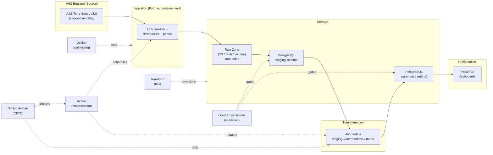

# NHS A&E Demand and Emergency Admissions Analytics Platform
## Phase 3: Architecture Design

**Project:** NHS A&E Demand and Emergency Admissions Analytics
**Phase:** 3 of 13
**Deliverables:** End-to-end architecture, per-component justification (purpose / benefits / risks / alternatives / cost / scalability), data-flow design, deployment topology
**Prerequisite:** Phases 1–2
**Next Phase:** Phase 4 — Platform Setup (Docker)

---

## 🧒 Explain Like I'm 10

> **Phase 3 is drawing the floor plan for the whole kitchen.**
>
> Before any cooking happens, a good kitchen designer decides where every station goes and *why*. Where do the delivery boxes get stacked? Where's the prep counter? Where are the stoves? Where does the finished plate sit before a waiter takes it out? And who is in charge of making everyone start at the right time?
>
> In Phase 3 we lay out all the stations and explain the reason for each one:
>
> - The **delivery dock** where boxes land exactly as they arrive → *Raw Zone*
> - The **prep counter** where we wash and chop → *PostgreSQL staging*
> - The **stoves** where the actual cooking happens → *dbt*
> - The **finished-dish fridge**, neatly organised so any waiter can grab a plate fast → *the data warehouse*
> - The **serving window** where the customer sees their meal → *Power BI*
> - The **head chef with a timer** shouting "start now!" → *Airflow*
> - The **food-safety inspector** tasting things at the door of the fridge → *Great Expectations*
> - A **kitchen-in-a-box** you can set up identically anywhere → *Docker*
> - The **building blueprint** for the whole restaurant → *Terraform*
> - The rule that **no new recipe is served until it's been taste-tested** → *GitHub Actions*
>
> For every station we also ask the grown-up questions: What is it for? Why is it good? What could go wrong? What else could we have used instead? How much does it cost? And what happens when the restaurant gets 10× busier? **That's the whole job of Phase 3 — decide the layout and defend every choice.**

---

## Table of Contents

1. [Architecture Philosophy](#1-architecture-philosophy)
2. [The End-to-End Diagram](#2-the-end-to-end-diagram)
3. [The Layered Data Flow (Medallion-Style)](#3-the-layered-data-flow)
4. [Component Deep-Dive: Python (Ingestion)](#4-python-ingestion)
5. [Component Deep-Dive: Object Storage (Raw Zone)](#5-object-storage-raw-zone)
6. [Component Deep-Dive: PostgreSQL (Staging + Warehouse)](#6-postgresql)
7. [Component Deep-Dive: dbt (Transformation)](#7-dbt-transformation)
8. [Component Deep-Dive: Great Expectations (Validation)](#8-great-expectations-validation)
9. [Component Deep-Dive: Airflow (Orchestration)](#9-airflow-orchestration)
10. [Component Deep-Dive: Power BI (BI Layer)](#10-power-bi-bi-layer)
11. [Component Deep-Dive: Docker (Containerisation)](#11-docker-containerisation)
12. [Component Deep-Dive: Terraform (IaC)](#12-terraform-iac)
13. [Component Deep-Dive: GitHub Actions (CI/CD)](#13-github-actions-cicd)
14. [Component Deep-Dive: Cloud — AWS Primary, Azure Alternative](#14-cloud)
15. [Deployment Topologies: Local vs Cloud](#15-deployment-topologies)
16. [Cost Model Summary](#16-cost-model-summary)
17. [Scalability Roadmap](#17-scalability-roadmap)
18. [Why This Stack? (Defending the Design in Interviews)](#18-why-this-stack)

---

## 1. Architecture Philosophy

Before naming a single tool, we commit to four principles. Every technology choice is judged against them.

| Principle | What It Means Here |
|-----------|--------------------|
| **Idempotency** | Running the pipeline twice produces the same result. No duplicates, no drift. Re-runs are safe — essential because NHS files get revised. |
| **Reproducibility** | Any state of the warehouse can be rebuilt from raw files + code alone. The raw zone is immutable; everything downstream is derived. |
| **Separation of concerns** | Ingestion, storage, transformation, validation, orchestration, and presentation are distinct layers. A change in one rarely forces a change in another. |
| **Cost-proportionate** | A monthly, ~450 KB file does not justify a streaming Spark cluster. The architecture is deliberately "right-sized" — and we document where we'd scale up if the data did. |

This is a deliberately **batch, modern-data-stack** design. It is not over-engineered, and Phase 3 explains every place where a heavier tool would have been the wrong answer.

---

## 2. The End-to-End Diagram

### Mermaid (renders in many Markdown viewers)



### ASCII fallback (always renders)

```
                          ┌───────────────────────────────────────────┐
                          │  GitHub Actions (CI/CD)                     │
                          │  tests code, runs dbt build, deploys DAGs   │
                          └───────────────┬─────────────────────────────┘
                                          │ deploys / triggers
                                          ▼
   ┌──────────┐   schedules    ┌────────────────────┐
   │ Airflow  │───────────────►│  Ingestion (Python) │
   │ (orch.)  │                │  scrape→download→    │
   └────┬─────┘                │  parse              │
        │ triggers             └──────────┬──────────┘
        │                                 │ writes raw bytes
        │                                 ▼
        │                       ┌────────────────────┐
        │                       │  RAW ZONE (S3/Blob) │  ◄── immutable archive
        │                       │  + manifest sidecar │
        │                       └──────────┬──────────┘
        │                                  │ load
        │                                  ▼
        │              ┌─────────────►┌────────────────────┐
        │              │ Great        │  PostgreSQL STAGING │
        │              │ Expectations │  (typed, audited)   │
        │              │ (validation) └──────────┬──────────┘
        │              │  gates ▲                │ dbt run
        │              │        │                ▼
        │ triggers     │        │      ┌────────────────────┐
        └──────────────┼────────┼─────►│  dbt TRANSFORMATION │
                       │        │      │ stg→int→marts       │
                       │        │      └──────────┬──────────┘
                       │        │                 │ build
                       │        └─────────────────┤ gates
                       │                          ▼
                       │                ┌────────────────────┐
                       │                │ PostgreSQL WAREHOUSE│
                       │                │ dim_* / fact_*      │
                       │                └──────────┬──────────┘
                       │                           │ import/direct query
                       │                           ▼
                       │                ┌────────────────────┐
                       │                │   POWER BI          │
                       │                │   dashboards        │
                       │                └────────────────────┘

   Cross-cutting:  Docker packages every service · Terraform provisions all cloud infra
```

The rest of Phase 3 justifies each box.

---

## 3. The Layered Data Flow

We use a **layered (medallion-style)** approach. Data only ever flows in one direction, and each layer has a single job. This is the spine of the whole platform.

```
┌────────────┐   ┌────────────┐   ┌──────────────┐   ┌────────────┐   ┌──────────┐
│  SOURCE    │──►│  RAW       │──►│  STAGING     │──►│  WAREHOUSE │──►│  BI      │
│            │   │  (bronze)  │   │ (silver)     │   │  (gold)    │   │          │
└────────────┘   └────────────┘   └──────────────┘   └────────────┘   └──────────┘
 NHS XLS file    Exact copy of    Typed, cleaned,    Dimensional      Dashboards
 (scraped)       the source,      deduplicated,      model: facts &   & KPIs for
                 never edited     audit columns      dimensions,      humans
                                  added              KPIs computed
```

| Layer | Job | Tool | Mutable? |
|-------|-----|------|----------|
| **Source** | The NHS publication | NHS England | n/a |
| **Raw (bronze)** | Byte-for-byte archive of what we downloaded | Object storage | **No — immutable** |
| **Staging (silver)** | Parse, type-cast, clean, add audit columns, one row per source row | PostgreSQL + dbt staging models | Rebuilt each run |
| **Warehouse (gold)** | Conformed dimensional model; KPIs; business logic | PostgreSQL + dbt marts | Rebuilt / SCD-tracked |
| **BI** | Human-facing dashboards | Power BI | Read-only |

**Why this matters:** if a KPI looks wrong, you can walk *backwards* through exactly these layers to find where it broke — a bad number is either in the source (raw), the cleaning (staging), the business logic (warehouse), or the visual (BI). Without clean layers, debugging is guesswork.

---

## 4. Python (Ingestion)

The language and runtime for the scrape → download → parse → load logic.

| Dimension | Detail |
|-----------|--------|
| **Purpose** | Resolve the NHS download link, fetch the XLS, parse messy multi-row headers, hash files/rows, write to the raw zone, and load typed records into staging. |
| **Benefits** | Best-in-class libraries for this exact job (`requests`, `BeautifulSoup`, `pandas`, `xlrd`, `hashlib`, `boto3`). Huge talent pool. First-class Airflow and dbt integration. Easy to unit-test. |
| **Risks** | Dynamic typing can hide data-type bugs → mitigate with type hints + `mypy` and strict casting at the staging boundary. Dependency sprawl → mitigate with pinned versions and a lockfile. |
| **Alternatives** | **Scala/Spark** (overkill for a 450 KB monthly file); **R** (great for stats, weaker for production pipelines/orchestration); **SQL-only ELT** (can't scrape HTML or parse arbitrary Excel). |
| **Cost** | Free, open-source. Compute is negligible — runs in seconds on the smallest container. |
| **Scalability** | More sources → add modular ingestors behind a shared framework (Phase 5). If volume ever explodes, the *parsing* step could move to Spark with no change to the surrounding architecture. |

> `.xls` (legacy binary) requires **`xlrd`**, not `openpyxl`. The ECDS file is `.xlsx` and uses `openpyxl`. Both are handled by `pandas` with the right engine.

---

## 5. Object Storage (Raw Zone)

The immutable landing area for downloaded files.

| Dimension | Detail |
|-----------|--------|
| **Purpose** | Store every downloaded file unmodified, forever, with a metadata manifest. The single source of truth from which everything can be rebuilt. |
| **Benefits** | Cheap, durable (11 nines on S3), versioned, decoupled from compute. Enables reproducibility and revision forensics (Phase 2 §10). |
| **Risks** | Accidental deletion/overwrite → mitigate with bucket versioning + object lock + least-privilege IAM. Region/egress surprises → keep storage and compute co-located. |
| **Alternatives** | **Local filesystem/volume** (fine for dev, not durable for prod); **HDFS** (heavyweight, on-prem); **storing raw inside Postgres as BLOBs** (anti-pattern — bloats the DB, loses cheap durability). |
| **Cost** | Trivial. ~450 KB/month → a few MB/year. Pennies on S3/Blob. |
| **Scalability** | Effectively infinite. Partition by `ingest_date`. Add lifecycle rules (e.g., Glacier) only if volume ever warranted — it won't here. |

> **Local-dev equivalent:** a mounted Docker volume (`./data/raw/`) behaves like the bucket so the same code path works locally and in cloud (the storage client is abstracted behind an interface).

---

## 6. PostgreSQL

The relational engine hosting both the **staging** schema and the **warehouse** (marts).

| Dimension | Detail |
|-----------|--------|
| **Purpose** | Typed staging tables, the dimensional warehouse (`dim_*`, `fact_ae_activity`), the metadata catalog (`meta.*`), and the SQL surface dbt builds on. |
| **Benefits** | Free, rock-solid, superb SQL (window functions, CTEs, `PERCENTILE_CONT`), JSONB for `_unmapped` drift capture, mature tooling, runs anywhere. Easily enough for this data volume. |
| **Risks** | Single-node scaling ceiling (irrelevant at our volume); backup discipline required → managed RDS/Flexible Server handles this in cloud. |
| **Alternatives** | **Snowflake / BigQuery / Redshift** (cloud warehouses — excellent but overkill and cost money for a dataset this small); **DuckDB** (brilliant for local analytics, but we want a persistent multi-user server); **SQLite** (no concurrency, not production-grade). |
| **Cost** | Free locally. Managed cloud (AWS RDS `db.t4g.micro` / Azure Flexible Server B1ms) is ~£12–25/month — the largest single line item, and still small. |
| **Scalability** | Read replicas, partitioning by `period`, and indexing cover us far beyond NHS A&E volumes. The dbt models are warehouse-portable, so a future move to Snowflake/BigQuery is a config change, not a rewrite. |

> **Key design decision:** staging and warehouse live in the **same** Postgres instance but in **separate schemas** (`staging`, `warehouse`/`marts`, `meta`). Clean separation without the cost/complexity of two databases.

---

## 7. dbt (Transformation)

The "T" in ELT — SQL-based transformation, testing, and documentation.

| Dimension | Detail |
|-----------|--------|
| **Purpose** | Turn raw staging rows into the dimensional model using version-controlled SQL: `sources → staging → intermediate → marts`. Also runs tests, generates docs, and produces a lineage graph. |
| **Benefits** | Transformation-as-code (Git, code review, CI). Built-in testing (`unique`, `not_null`, `relationships`, custom). Auto-generated docs + lineage DAG. Incremental models for efficient revision reloads. Reusable macros (e.g., the safe-percentage macro). |
| **Risks** | Can encourage "SQL spaghetti" if un-modularised → mitigate with strict layer conventions and naming standards. Full-refresh cost on big tables → mitigate with incremental models keyed on `period`. |
| **Alternatives** | **Hand-written SQL scripts** (no testing, no lineage, no docs — regressive); **stored procedures** (hard to version/test); **Spark/PySpark** (overkill); **SQLMesh** (newer dbt-alternative, smaller ecosystem). |
| **Cost** | dbt Core is free and open-source. (dbt Cloud is optional paid SaaS — not required; we run dbt Core in a container, orchestrated by Airflow.) |
| **Scalability** | Scales with the warehouse beneath it. Incremental models mean only changed periods rebuild. Model count grows cleanly with conventions. |

> dbt is where Phase 6's dimensional model and Phase 8's full model tree are implemented. Performance percentages are **recomputed here** from counts (Phase 2 decision).

---

## 8. Great Expectations (Validation)

The automated data-quality gate.

| Dimension | Detail |
|-----------|--------|
| **Purpose** | Validate data at the gates — after staging load and after warehouse build — for nulls, volumes, freshness, ranges, duplicates, and reconciliation against published totals (Phase 7). |
| **Benefits** | Declarative "expectations," human-readable Data Docs, pluggable into Airflow as a gating task (fail = stop pipeline + alert). Catches the Phase 2 traps (revisions, drift, missing months) before they reach dashboards. |
| **Risks** | Verbose configuration; learning curve. Over-strict suites cause false alarms → tune thresholds and use warn-vs-fail tiers. |
| **Alternatives** | **dbt tests** (good for in-warehouse constraints, weaker for file-level/statistical checks — we use *both*, complementarily); **Soda Core** (lighter, smaller ecosystem); **Pandera** (great for in-DataFrame checks at parse time — we use it for the *ingestion* step); **bespoke assertions** (reinvents the wheel, no Data Docs). |
| **Cost** | Free, open-source. Compute negligible. |
| **Scalability** | Suites are modular per dataset; add a suite per new source. Checkpoints run independently. |

> **Layering of checks:** Pandera at parse time (row shape/types) → Great Expectations at the staging and warehouse gates (statistical + reconciliation) → dbt tests inside the model build (referential integrity). Defence in depth.

---

## 9. Airflow (Orchestration)

The scheduler and dependency manager — the head chef.

| Dimension | Detail |
|-----------|--------|
| **Purpose** | Schedule the monthly run (around the 2nd-Thursday release), enforce task order (scrape → download → validate → stage → dbt → validate → refresh), handle retries, and surface failures. |
| **Benefits** | Battle-tested, rich UI, retries/backoff, SLAs, alerting, mature operators for bash/Python/dbt/GE. DAGs are Python — version-controlled and testable. |
| **Risks** | Operationally heavy (scheduler + webserver + workers + metadata DB); steep first-time setup → mitigate with the Docker Compose stack (Phase 4) and managed Airflow (MWAA / Azure equivalent) in prod. |
| **Alternatives** | **Cron** (no dependencies, retries, or visibility — too primitive for a gated multi-step pipeline); **Prefect** (lighter, modern, smaller ecosystem — a reasonable alternative); **Dagster** (asset-centric, excellent, newer); **GitHub Actions on a schedule** (fine for trivial jobs, weak for complex DAGs). |
| **Cost** | Free self-hosted. Managed AWS MWAA ~£250+/month (notable!) → for a monthly job we may instead run **Airflow in a small container** or use a lighter scheduler in prod to control cost. Documented as a real cost trade-off. |
| **Scalability** | Add workers / switch to Celery/Kubernetes executor for parallelism. Vastly more than a monthly job needs — we right-size the executor (LocalExecutor) accordingly. |

> **Honest trade-off:** Airflow is arguably heavier than a once-a-month job requires. We use it because (a) it's the industry-standard skill to demonstrate, and (b) the roadmap (V2/V3, ECDS, streaming) grows into it. For a pure cost-minimal prod, Prefect or a scheduled container would also be defensible — and saying so in an interview shows maturity.

---

## 10. Power BI (BI Layer)

The presentation and dashboard layer — the serving window.

| Dimension | Detail |
|-----------|--------|
| **Purpose** | Deliver the five dashboards (National Trends, Provider Rankings, Emergency Admissions, 4-Hour Performance, Operational Command Center) with DAX measures, drill-through, and RAG indicators. |
| **Benefits** | Dominant in NHS/UK public sector (so it's the *right* skill for NHS-adjacent roles), strong DAX modelling, scheduled refresh, row-level security, wide stakeholder familiarity. |
| **Risks** | Proprietary/Windows-centric authoring; licensing for sharing (Pro/Premium); DAX learning curve. Mitigate by keeping heavy logic **in the warehouse**, not in DAX. |
| **Alternatives** | **Tableau** (excellent, less common in NHS); **Looker** (BigQuery-centric, licence cost); **Metabase / Apache Superset** (open-source, free, good for a public portfolio demo without Power BI licensing) — we note Superset as the free alternative for anyone who can't license Power BI. |
| **Cost** | Power BI Desktop is free to author; sharing needs Pro (~£8/user/month) or Premium. For a portfolio, publish to free **Power BI public** or screenshot, or use Superset. |
| **Scalability** | Import mode with incremental refresh, or DirectQuery against Postgres for larger data. Aggregations/composite models if needed. |

> **Architecture rule:** keep business logic in the warehouse (dbt), keep *presentation* logic in Power BI. This keeps the BI layer thin and portable — you could swap Power BI for Superset without touching a KPI definition.

---

## 11. Docker (Containerisation)

Packaging every service into reproducible containers — the kitchen-in-a-box.

| Dimension | Detail |
|-----------|--------|
| **Purpose** | Run Postgres, Airflow, dbt, and the ingestion app as containers so the whole platform starts identically on any machine (`docker compose up`). |
| **Benefits** | "Works on my machine" eliminated. Pinned, reproducible environments. Same images locally and in cloud. Easy onboarding (Phase 4 is one command). |
| **Risks** | Image bloat / security drift in base images → mitigate with slim base images and scanning. Local resource use (Airflow stack is hungry) → document minimum specs. |
| **Alternatives** | **Bare-metal/venv installs** (environment drift, painful setup); **Vagrant VMs** (heavier, slower); **Nix** (powerful, steep learning curve). |
| **Cost** | Free (Docker Engine / Compose). |
| **Scalability** | Compose for local; the same images run on ECS/Fargate, Azure Container Apps, or Kubernetes in prod (Phase 10). |

---

## 12. Terraform (IaC)

Infrastructure-as-code — the building blueprint.

| Dimension | Detail |
|-----------|--------|
| **Purpose** | Declare cloud infra (storage bucket, managed Postgres, networking, IAM, secrets) as version-controlled code, applied reproducibly. |
| **Benefits** | Reproducible, reviewable infra; no click-ops drift; easy teardown/rebuild (great for cost control — destroy a demo env when idle); multi-cloud via providers. |
| **Risks** | State-file management (locking, secrets in state) → use remote state (S3 + DynamoDB lock / Azure Storage) and never commit state. Blast radius of a bad `apply` → use plans, reviews, and workspaces. |
| **Alternatives** | **AWS CloudFormation / Azure Bicep** (cloud-locked); **Pulumi** (IaC in real languages — nice, smaller community); **manual console** (unreproducible — the thing we're avoiding). |
| **Cost** | Terraform itself is free (open-source CLI). It provisions paid resources — but also makes it trivial to *destroy* them when not demoing. |
| **Scalability** | Modules per environment (dev/prod); remote state; CI-driven `plan`/`apply`. Scales to large estates cleanly. |

---

## 13. GitHub Actions (CI/CD)

Continuous integration and deployment — the "no recipe ships untested" rule.

| Dimension | Detail |
|-----------|--------|
| **Purpose** | On every push/PR: lint, run unit/integration tests, run `dbt build` against a test DB, validate Terraform plans, build/scan Docker images, and deploy DAGs. |
| **Benefits** | Native to GitHub, free tier for public repos, huge marketplace of actions, simple YAML, secrets management. Stops broken code/SQL reaching prod. |
| **Risks** | Secret leakage in logs → use encrypted secrets, never echo them; runner trust for third-party actions → pin action versions by SHA. |
| **Alternatives** | **GitLab CI** (excellent, if on GitLab); **Jenkins** (powerful, heavy to self-host); **CircleCI / Azure Pipelines** (fine, less default for GitHub repos). |
| **Cost** | Free for public repos; generous free minutes for private. |
| **Scalability** | Matrix builds, reusable workflows, self-hosted runners if needed. Far beyond this project's needs. |

---

## 14. Cloud

AWS is the primary target; Azure is the documented alternative (relevant because much of the **NHS runs on Azure**).

### Service Mapping

| Capability | AWS (Primary) | Azure (Alternative) | Local Dev |
|------------|---------------|---------------------|-----------|
| Object storage (raw zone) | S3 | Blob Storage | Docker volume |
| Managed Postgres | RDS for PostgreSQL | Database for PostgreSQL (Flexible Server) | Postgres container |
| Orchestration | MWAA *or* ECS-hosted Airflow | Azure Container Apps / AKS Airflow | Airflow container |
| Compute for ingestion/dbt | ECS Fargate task | Azure Container Apps job | Docker container |
| Secrets | Secrets Manager / SSM | Key Vault | `.env` (gitignored) |
| IaC | Terraform (aws provider) | Terraform (azurerm provider) | n/a |
| CI/CD | GitHub Actions | GitHub Actions | n/a |

| Dimension | Detail |
|-----------|--------|
| **Purpose** | Durable storage, managed database, scheduled compute, secrets, and networking for the production deployment. |
| **Benefits (AWS)** | Mature, broad service set, best Terraform support, cheapest small-Postgres options. |
| **Benefits (Azure)** | NHS-aligned (many trusts/ICBs are Azure + Power BI shops), tight Power BI/Entra integration — often the *more credible* choice for an NHS-facing role. |
| **Risks** | Egress/region cost surprises; over-provisioning. Mitigate with Terraform-driven teardown, small instance classes, and budget alerts. |
| **Cost** | The whole prod estate for this volume runs at roughly **£15–40/month** if always-on, or **near-zero** if you Terraform-destroy between demos. (Detail in §16.) |
| **Scalability** | Managed services scale vertically/horizontally on demand; the architecture doesn't change, only instance sizes. |

> **Recommendation for an NHS-targeted portfolio:** build primary on AWS (broadest skill signal) but explicitly document the Azure mapping. Being able to say "I'd deploy this on Azure for an NHS client because of Entra/Power BI integration and existing trust tenancy" is a strong interview moment.

---

## 15. Deployment Topologies

### Topology A — Local (Development)

Everything in Docker Compose on one machine. Zero cloud cost. This is Phase 4.

```
┌─────────────────────── Docker Compose (one host) ───────────────────────┐
│  [postgres]   [airflow-webserver]  [airflow-scheduler]                    │
│  [ingestion-app]   [dbt]   [great-expectations]                           │
│  volumes: ./data/raw  ./pgdata                                            │
└───────────────────────────────────────────────────────────────────────────┘
        Power BI Desktop (on host) ──► connects to localhost:5432
```

### Topology B — Cloud (Production)

```
GitHub ──(Actions)──► build/test ──► Terraform apply
                                         │
        ┌────────────────────────────────┼─────────────────────────────┐
        ▼                                ▼                              ▼
   [S3 raw zone]                  [RDS PostgreSQL]              [Secrets Manager]
        ▲                                ▲
        │                                │
   [ECS Fargate: ingestion]        [ECS Fargate: dbt]
        ▲                                ▲
        └──────────── Airflow (MWAA or ECS) schedules both ────────────┘
                                         │
                                         ▼
                          Power BI Service (scheduled refresh,
                          DirectQuery/Import from RDS)
```

The same container images run in both topologies — that's the payoff of Docker (§11).

---

## 16. Cost Model Summary

> **Default build = £0.** The recommended portfolio build runs entirely on your own laptop in Docker and uses free tooling throughout (MinIO for S3, LocalStack for AWS/Terraform, GitHub Actions for the recurring run, Power BI Desktop or Superset for dashboards). The cloud deployment below is the **optional paid upgrade**, kept for completeness and to demonstrate cloud skills. See **Appendix A — The Zero-Cost Edition** for the full free build path. Phases 4 and 10 default to the zero-cost setup.

Indicative monthly cost for an always-on cloud deployment (AWS, London region, smallest sensible sizing) — **optional**:

| Component | Service / Size | Approx. £/month |
|-----------|----------------|-----------------|
| Raw storage | S3, a few MB | < £0.10 |
| Database | RDS Postgres `db.t4g.micro` | £12–18 |
| Ingestion compute | ECS Fargate, seconds/month | < £1 |
| dbt compute | ECS Fargate, minutes/month | < £1 |
| Orchestration | Airflow on small ECS task (not MWAA) | £5–15 |
| Secrets | Secrets Manager (few secrets) | < £1 |
| CI/CD | GitHub Actions (public repo) | £0 |
| **Total (always-on)** | | **≈ £20–35** |
| **Total (destroy-between-demos)** | Terraform `destroy` when idle | **≈ £0–2** |

**Two big cost levers, both documented as interview talking points:**
1. **Avoid managed Airflow (MWAA ≈ £250+/mo)** for a monthly job — self-host a small Airflow container or use Prefect.
2. **Terraform teardown** — for a portfolio you only need infra up during a demo; destroy it otherwise and the bill is effectively zero.

---

## 17. Scalability Roadmap

The architecture is right-sized for a small monthly file but has a clean growth path. Each step changes *sizing or a single component*, never the overall shape.

| Trigger | Response | What Changes |
|---------|----------|--------------|
| Add ECS/demographic ECDS data (V2) | New ingestor + new dbt models + new GE suite | Add components in the existing layers |
| Add bed occupancy + ambulance handover (V3) | Additional sources behind the same framework | More DAGs/models, same pattern |
| Data volume grows 100× | Switch warehouse to BigQuery/Snowflake | dbt models port over; only the adapter changes |
| Need sub-daily freshness | Move parsing to Spark / add streaming (Kafka) | Replace the batch ingestor; layers unchanged |
| Many concurrent BI users | DirectQuery + aggregations, or replicas | BI/DB sizing only |
| ML demand forecasting | Feature store + model service reading the gold layer | New consumer of existing warehouse |

This is the "starts small, grows without a rewrite" property — and it's exactly what senior interviewers probe for.

---

## 18. Why This Stack?

A concise, defensible summary you can deliver verbally in an interview.

> "I chose a **batch modern-data-stack** deliberately sized to the problem. The source is a small monthly Excel file with awkward, well-documented quirks — revisions, a random download URL, schema drift, and historical caveats — so the hard part isn't *volume*, it's *correctness and trust*. The architecture reflects that: an **immutable raw zone** for reproducibility, **PostgreSQL** because the data comfortably fits and the SQL is first-class, **dbt** for tested, documented, version-controlled transformations, **Great Expectations** for gating data quality, **Airflow** for orchestrated, retryable runs, and **Power BI** because it's the NHS-standard presentation layer. **Docker, Terraform, and GitHub Actions** make the whole thing reproducible and shippable. I avoided heavyweight tools like Spark and Snowflake because at ~450 KB a month they'd add cost and complexity for no benefit — but the design ports to them cleanly if the data ever grew, which I can walk through."

That paragraph demonstrates: domain understanding, right-sizing judgment, awareness of alternatives, and a growth story. It's the whole point of Phase 3.

---

## Phase 3 Complete

### Deliverables Produced

| Deliverable | Section |
|-------------|---------|
| End-to-end architecture (Mermaid + ASCII) | §2 |
| Layered data-flow design | §3 |
| Per-component justification (purpose/benefits/risks/alternatives/cost/scalability) for all 11 technologies | §4–§14 |
| Local vs cloud deployment topologies | §15 |
| Cost model | §16 |
| Scalability roadmap | §17 |
| Interview-ready design defence | §18 |

### What to Learn Before Phase 4

| Topic | Why |
|-------|-----|
| Docker & Docker Compose basics (images, containers, volumes, networks) | Phase 4 builds the entire local stack in Compose |
| Environment variables & `.env` files | Secrets/config management in the local stack |
| Basic networking (ports, host vs container) | Connecting Power BI/host to the Postgres container |
| Postgres connection strings | Wiring dbt and the app to the database |

### Phase 4 Preview

Phase 4 — Platform Setup: the complete `docker-compose.yml` (Postgres + Airflow + dbt + ingestion), Dockerfiles, environment-variable and secrets strategy, the local development environment, setup instructions, and a troubleshooting guide. This is where the kitchen gets physically built and you run `docker compose up` for the first time.

---

*Document: Phase 3 of 13 | NHS A&E Analytics Platform | Version 1.0*
